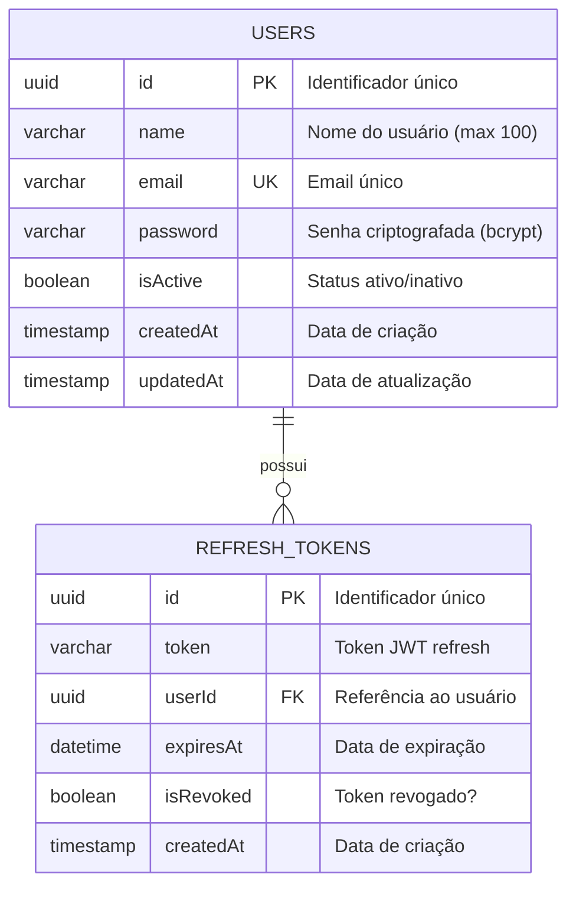

# 📊 Database Schema - BellsPretty API

## 📐 Diagrama Entidade-Relacionamento (ER)

### Visão Geral



### Diagrama Simplificado (ASCII)

```
┌──────────────────────┐
│      USERS           │
├──────────────────────┤
│ 🔑 id (PK)          │
│ 📝 name             │
│ ✉️  email (UNIQUE)   │
│ 🔒 password         │
│ ✅ isActive         │
│ 📅 createdAt        │
│ 📅 updatedAt        │
└──────────┬───────────┘
           │
           │ 1:N
           │
           ▼
┌──────────────────────┐
│  REFRESH_TOKENS      │
├──────────────────────┤
│ 🔑 id (PK)          │
│ 🎫 token            │
│ 👤 userId (FK) ─────┘
│ ⏰ expiresAt        │
│ ❌ isRevoked        │
│ 📅 createdAt        │
└──────────────────────┘
```

---

## 🗄️ Tabelas do Banco de Dados

### 1. **`users`** - Usuários do Sistema

Armazena informações dos usuários cadastrados na plataforma.

| Coluna | Tipo | Constraints | Descrição |
|--------|------|-------------|-----------|
| `id` | UUID | PRIMARY KEY | Identificador único do usuário |
| `name` | VARCHAR(100) | NOT NULL | Nome completo do usuário |
| `email` | VARCHAR | UNIQUE, NOT NULL | Email único para login |
| `password` | VARCHAR | NOT NULL | Senha criptografada com bcrypt |
| `isActive` | BOOLEAN | DEFAULT true | Status do usuário (ativo/inativo) |
| `createdAt` | TIMESTAMP | NOT NULL | Data e hora de criação |
| `updatedAt` | TIMESTAMP | NOT NULL | Data e hora da última atualização |

**Índices:**
- `PK_users`: PRIMARY KEY em `id`
- `UQ_users_email`: UNIQUE em `email`

**Relacionamentos:**
- Um usuário pode ter múltiplos refresh tokens (1:N)

**Validações:**
- Email deve ser único no sistema
- Senha é sempre armazenada criptografada (bcrypt, salt rounds: 10)
- Nome tem limite de 100 caracteres

---

### 2. **`refresh_tokens`** - Tokens de Atualização

Armazena os refresh tokens para renovação de access tokens JWT.

| Coluna | Tipo | Constraints | Descrição |
|--------|------|-------------|-----------|
| `id` | UUID | PRIMARY KEY | Identificador único do token |
| `token` | VARCHAR | NOT NULL | String do refresh token JWT |
| `userId` | UUID | FOREIGN KEY, NOT NULL | Referência ao usuário proprietário |
| `expiresAt` | DATETIME | NOT NULL | Data/hora de expiração do token |
| `isRevoked` | BOOLEAN | DEFAULT false | Token foi revogado? |
| `createdAt` | TIMESTAMP | NOT NULL | Data e hora de criação |

**Índices:**
- `PK_refresh_tokens`: PRIMARY KEY em `id`
- `FK_refresh_tokens_userId`: FOREIGN KEY em `userId` → `users.id`
- `IDX_refresh_tokens_token`: INDEX em `token` (para buscas rápidas)
- `IDX_refresh_tokens_userId`: INDEX em `userId` (para buscas por usuário)

**Relacionamentos:**
- Pertence a um usuário (N:1)
- `ON DELETE CASCADE`: Se usuário for deletado, seus tokens também são

**Regras de Negócio:**
- Validade padrão: 7 dias
- Tokens podem ser revogados (logout)
- Tokens expirados são mantidos para auditoria
- Múltiplos tokens ativos por usuário (multi-device support)

---

## 🔗 Relacionamentos

### User ← RefreshToken (1:N)

```typescript
// User pode ter múltiplos refresh tokens
class User {
  @OneToMany(() => RefreshToken, (refreshToken) => refreshToken.user)
  refreshTokens: RefreshToken[];
}

// RefreshToken pertence a um User
class RefreshToken {
  @ManyToOne(() => User, (user) => user.refreshTokens, { onDelete: 'CASCADE' })
  @JoinColumn({ name: 'userId' })
  user: User;
}
```

**Cascade Behavior:**
- Deletar usuário → Deleta automaticamente todos os seus refresh tokens
- Deletar refresh token → Não afeta o usuário

---

## 📊 Diagrama de Dados (Exemplo)

```
┌─────────────────────────┐
│ users                   │
├─────────────────────────┤
│ id: "abc-123-..."       │
│ name: "João Silva"      │
│ email: "joao@email.com" │
│ password: "$2b$10$..."  │
│ isActive: true          │
│ createdAt: 2025-11-10   │
│ updatedAt: 2025-11-10   │
└───────────┬─────────────┘
            │
            │ (1:N)
            ▼
┌─────────────────────────┐
│ refresh_tokens          │
├─────────────────────────┤
│ id: "def-456-..."       │
│ token: "eyJhbGc..."     │
│ userId: "abc-123-..."   │◄─── FK
│ expiresAt: 2025-11-17   │
│ isRevoked: false        │
│ createdAt: 2025-11-10   │
└─────────────────────────┘
```

---

## 🔍 Queries Úteis

### Buscar usuário com seus tokens ativos

```sql
SELECT 
    u.id,
    u.name,
    u.email,
    COUNT(rt.id) as active_tokens
FROM users u
LEFT JOIN refresh_tokens rt ON rt.userId = u.id 
    AND rt.isRevoked = false 
    AND rt.expiresAt > datetime('now')
WHERE u.isActive = true
GROUP BY u.id;
```

### Listar tokens expirados ou revogados

```sql
SELECT 
    rt.id,
    rt.token,
    u.email,
    rt.expiresAt,
    rt.isRevoked,
    rt.createdAt
FROM refresh_tokens rt
JOIN users u ON u.id = rt.userId
WHERE rt.isRevoked = true 
   OR rt.expiresAt < datetime('now')
ORDER BY rt.createdAt DESC;
```

### Contar usuários por status

```sql
SELECT 
    isActive,
    COUNT(*) as total
FROM users
GROUP BY isActive;
```

### Cleanup de tokens expirados (manutenção)

```sql
-- SQLite
DELETE FROM refresh_tokens
WHERE expiresAt < datetime('now', '-30 days');

-- PostgreSQL
DELETE FROM refresh_tokens
WHERE expiresAt < NOW() - INTERVAL '30 days';
```

---

## 📈 Performance e Índices

### Índices Existentes

1. **users.email** (UNIQUE)
   - Otimiza login por email
   - Garante unicidade

2. **refresh_tokens.token** (INDEX)
   - Otimiza validação de tokens
   - Queries frequentes em refresh

3. **refresh_tokens.userId** (INDEX + FK)
   - Otimiza busca de tokens por usuário
   - Necessário para JOIN com users

### Recomendações de Performance

```sql
-- Para PostgreSQL, considere adicionar:
CREATE INDEX idx_refresh_tokens_expires 
ON refresh_tokens(expiresAt) 
WHERE isRevoked = false;

-- Partial index para tokens válidos
CREATE INDEX idx_active_tokens 
ON refresh_tokens(userId, expiresAt) 
WHERE isRevoked = false;
```

---

## 🔐 Segurança

### Dados Sensíveis

- ❌ **Nunca** retorne o campo `password` em APIs
- ❌ **Nunca** logue senhas em plaintext
- ✅ Use `bcrypt` com salt rounds >= 10
- ✅ Tokens JWT devem ter assinatura segura (HS256 ou RS256)

### Exemplo de Query Segura

```typescript
// ✅ Correto - Exclui password
const user = await userRepository.findOne({
  where: { email },
  select: ['id', 'name', 'email', 'isActive', 'createdAt']
});

// ❌ Errado - Expõe password
const user = await userRepository.findOne({ where: { email } });
```

---

## 🚀 Migrações Futuras (Roadmap)

Quando implementar o módulo de mensageria, adicionar:

### 3. **`messages`** - Histórico de Mensagens
```typescript
{
  id: uuid,
  type: enum('whatsapp', 'email', 'sms', 'messenger'),
  recipient: string,
  content: text,
  status: enum('pending', 'sent', 'delivered', 'failed'),
  providerId: string,
  userId: uuid, // FK → users
  createdAt: timestamp,
  sentAt: timestamp,
  deliveredAt: timestamp
}
```

### 4. **`message_templates`** - Templates Reutilizáveis
```typescript
{
  id: uuid,
  name: string,
  type: enum('whatsapp', 'email', 'sms', 'messenger'),
  subject: string,
  body: text,
  variables: json, // ex: ["nome", "data"]
  userId: uuid, // FK → users
  createdAt: timestamp,
  updatedAt: timestamp
}
```

### 5. **`message_logs`** - Auditoria de Eventos
```typescript
{
  id: uuid,
  messageId: uuid, // FK → messages
  event: enum('queued', 'sent', 'delivered', 'read', 'failed'),
  details: json,
  timestamp: timestamp
}
```

---

## 📚 Referências Rápidas

| Recurso | Localização |
|---------|-------------|
| **Entidades TypeORM** | `src/entities/` |
| **Migrações** | `src/migrations/` |
| **Configuração DB** | `src/config/database.config.ts` |
| **Schema SQL** | `docs/schema.sql` |
| **Documentação DB** | `DATABASE.md` |

---

## 🛠️ Scripts Úteis

```bash
# Visualizar schema atual
npm run typeorm schema:log

# Gerar migration automática
npm run migration:generate -- --name=NomeDaMigration

# Executar migrations
npm run migration:run

# Reverter última migration
npm run migration:revert

# Sincronizar schema (apenas dev)
npm run schema:sync
```

---

**📅 Última atualização:** 10/11/2025  
**📌 Versão:** 1.0.0  
**🗄️ Total de tabelas:** 2 (users, refresh_tokens)
