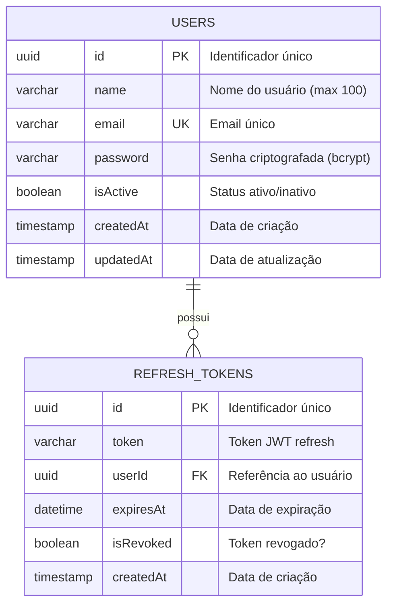

# 📊 Database Schema - BellsPretty API

## 📐 Diagrama Entidade-Relacionamento (ER)

### Visão Geral



### Diagrama Simplificado (ASCII)

```
┌──────────────────────┐
│      USERS           │
├──────────────────────┤
│ 🔑 id (PK)          │
│ 📝 name             │
│ ✉️  email (UNIQUE)   │
│ 🔒 password         │
│ ✅ isActive         │
│ 📅 createdAt        │
# Deprecated documentation — Use the official schema doc

This file is deprecated. The single canonical schema documentation is:

- `DATABASE_SCHEMA_NEW.md` (kept in the repository root)

And the SQL DDL is available at:

- `docs/schema_v2.sql`

If you need historical or legacy schema docs, please open an issue instead of keeping multiple copies in the repo; for now we maintain a single authoritative file to avoid drift.
| Recurso | Localização |
|---------|-------------|
| **Entidades TypeORM** | `src/entities/` |
| **Migrações** | `src/migrations/` |
| **Configuração DB** | `src/config/database.config.ts` |
| **Schema SQL** | `docs/schema.sql` |
| **Documentação DB** | `DATABASE.md` |

---

## 🛠️ Scripts Úteis

```bash
# Visualizar schema atual
npm run typeorm schema:log

# Gerar migration automática
npm run migration:generate -- --name=NomeDaMigration

# Executar migrations
npm run migration:run

# Reverter última migration
npm run migration:revert

# Sincronizar schema (apenas dev)
npm run schema:sync
```

---

**📅 Última atualização:** 10/11/2025  
**📌 Versão:** 1.0.0  
**🗄️ Total de tabelas:** 2 (users, refresh_tokens)


